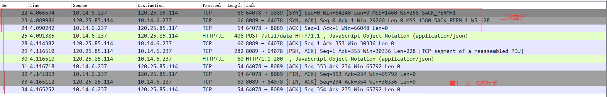
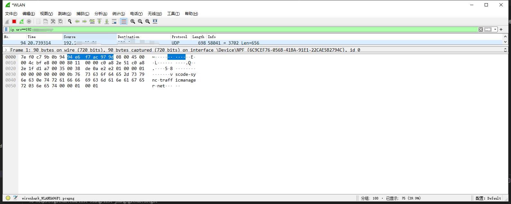

## HTTP 协议
### HTTP/1 1999年
每次请求， 基于 `TCP` 协议 client 端重新与 server 端建立一条双向连接，客户端发送完数据，服务端全部接收，并返回响应数据，一次请求正常完成。

### HTTP/2 2005年5月 `RFC 7540` 
在 HTTP/1 的基础上优化
- 多路复用
在 HTTP/1 的基础上优化，合并多个 TCP 连接为一个，多个请求复用一个 TCP 连接
- 服务器推送 [Server Push](https://www.cnblogs.com/fengxuehuanlin/p/5347347.html)
server 端不再死死的等待 client 的请求，可以主动向 client 端发送数据
- 头部压缩
HTTP标头字段被压缩成一系列包含头块碎片帧

### HTTP/3 2017年
#### HTTP/2 进化空间
- HTTP/2 的数据传输是有序的，即发送一串数据，必定是按照顺序来的，如果中间存在丢失，后面的不会发送，会等中间的发送成功了再继续发送。
- HTTP/2 TCP与TLS叠加了握手时延，建链时长还有1倍的下降空间
- 基于TCP四元组确定一个连接，这种诞生于有线网络的设计，并不适合移动状态下的无线网络，这意味着IP地址的频繁变动会导致TCP连接、TLS会话反复握手，成本高昂。

#### 解决方案
- HTTP/3 基于UDP协议重新定义了连接，在 QUIC(quick udp internet connection) 层实现了无序、并发字节流的传输，解决了队头阻塞问题（包括基于 QPACK 解决了动态表的队头阻塞）；
- HTTP/3 重新定义了`TLS`协议加密`QUIC`头部的方式，既提高了网络攻击成本，又降低了建立连接的速度（仅需1个`RTT`就可以同时完成建链与密钥协商）；
- HTTP/3 将`Packet`、`QUIC Frame`、`HTTP3 Frame`分离，实现了连接迁移功能，降低了5G环境下高速移动设备的连接维护成本。

## TCP (Transmission Control Protocol) 协议的 `三次握手`，`四次挥手`
### 关键字
#### 通信动作类型
- SYN：Synchronize Sequence Numbers 同步动作
- ACK：Acknowledge 确认动作
- PSH: Push 数据传输动作
- FIN：Finish 结束动作
- RST：Rest 重置动作
- URG：Urgent 紧急
#### 通信动作属性
- Seq：Sequence 同步序列号
- Ack：Acknowledge number 确认号码
- Len：Lenght 数据长度
### 三次握手
只说些我知道的数据含义，不知道的就不解释了
1. client ==> server `[SYN] Seq=x`  
   client 通过 ip 协议将包含上面这个东西的报文发送给 server，`x` 为客户端自己定义的这次TCP通信的同步序列号。server 通过有且只有 `SYN` 确定是一个 client 请求 tcp 连接的网络通信,对其做出响应回发报文。

2. server ==> client `[SYN, ACK] Seq=y Ack=x + 1` 
   server 通过 ip 协议将包含上面这个东西的报文发送给 client，`y` 为服务端自己定义的这次TCP通信的同步序列号。Ack 在接收到的 client 的 Seq 的基础上 `+1` ,用于告诉 client 我这次响应对应的是你的哪个请求（客户端是可以向服务端发起多个请求的，所以客户端对于服务的这个 ip 会存在多个 `x`）。

3. client ==> server `[ACK] Seq=1 Ack=y + 1 Len=0` 
    client 通过 ip 协议将包含上面这个东西的报文发送给 server,  Ack=`y+1` 用于告诉 server 我接收到了你的哪个响应, Seq 带的是后面要发送数据的起始序列，Len表示这次传输的数据长度，便于服务端确认客户端发起的下次请求有没有丢包，如果丢包了，下次客户端发起的 TCP 通信的 Seq 会比预期值大，就叫客户端从丢失的包开始重发。

### 四次挥手
ip.addr==120.25.85.114 && tcp.port==8089
ip.addr==169.254.243.16 && tcp.port==8080

断开 TCP 请求既有可能是客户端发起，也有可能是服务端发起，此处用 A 指代断开TCP连接动作发起方，B 指代被动方
此处有个坑：如果我们测试的时候使用的地址为远程服务地址，这里会存在第 2 步丢失的情况，如下图。原因是

我们可请求本地服务，通过端口通信方向来确定是服务端还是客户端
1. A ==> B `[FIN, ACK] Seq=352 Ack=232`  
   A 向 B 发起关闭 TCP 连接通信动作，包含一个 Seq 与一个 Ack。如果是客户端发起的关闭连接，这两个值为客户端接收服务的返回报文的最后一次确认通信时发送的值
2. B ==> A `[ACK] Seq=232 Ack=353`  
   B 回应 A 的关闭 TCP 连接通信，Seq 为 A 发过来的 Ack 值，Ack 值为发过来的 Seq + 1。
3. B ==> A `[FIN, ACK] Seq=232 Ack=353`  
   B 向 A 发起关闭 TCP 连接通信动作，Seq 为 A 发过来的 Ack 值，Ack 值为发过来的 Seq + 1。
4. A ==> B `[ACK] Seq=353 Ack=233`  
   A 回应 B 的关闭 TCP 连接通信。Seq 为 B 发过来的 Ack 值，Ack 值为发过来的 Seq + 1。
四次挥手后，A 等待 2MSL (`Maximum Segment Lifetime 报文最大有效时间`) 后关闭， B 接收到了就立刻关闭，如果超过 1MSL 没有接收到 A 的第四次挥手通信包，就重发第三次。
> 上面这些传输过程中的数字都是为了确保双方的身份，具体数字大小没有含义。

#### 三次握手的必要性
一次的话就是udp了
两次的话，服务端无法确认请求连接的 `tcp通信包` 里面的 ip 是不是无效的恶意数据。很容易造成大量资源被黑客浪费。
三次的话，server 确认在网络世界中，有一个 client 是处理了服务器的响应数据的。
四次的话，已经是资源浪费了。
#### 四次挥手的必要性
一个Tcp连接是在两台计算机都存了对应的数据的，那么Tcp断开的话需要双方都确认才行，不然的话，一个说断了，一个没断。那么没断的那个势必会出错。那么最起码需要三次。
三次的话，那么第二次的发送时间不好处理，因为此时如果有数据包未处理完成的话会造成数据的丢失，所以四次。那个超市 2MSL 是为了处理第四次通信包丢失的情况。
> ?? 没有完美的，都是取舍。
### WireShark
一款基于网关监听的网络包分析工具，配置监听的网关后，就可以看到所有经过这个网关的网络包，再自己根据场景设置筛选规则即可得到我们需要查看的网络包传输记录。
1. 配置监听网关 
   捕获 -> 选项 -> 选择网关（访问 `127.0.0.1` 的话需要选择`Adapter for loopback traffic capture`）
2. 配置筛选规则 
   基本的有：`ip.addr`,`ip.src`,`ip.target`,`tcp.port`

