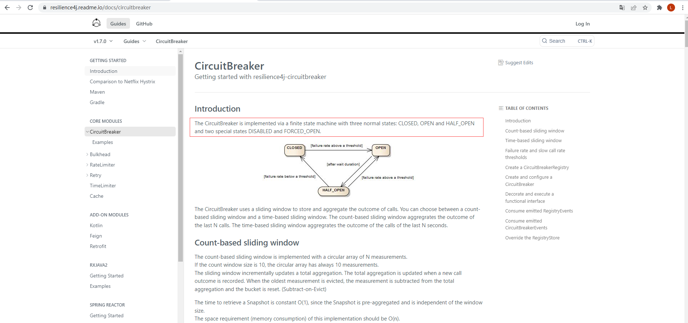
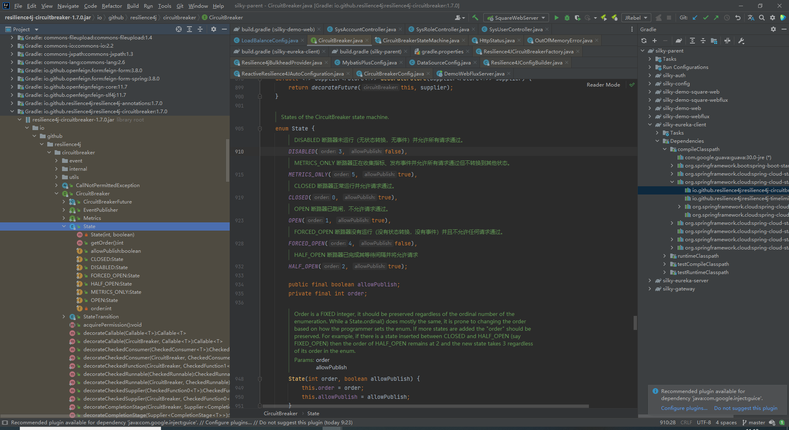

# Spring Cloud Circuit Breaker
- 官网地址：[https://spring.io/projects/spring-cloud-circuitbreake](https://spring.io/projects/spring-cloud-circuitbreake)
- 官方案例地址：[https://github.com/spring-cloud-samples/spring-cloud-circuitbreaker-demo](https://github.com/spring-cloud-samples/spring-cloud-circuitbreaker-demo)
- **核心思想还得看这个：**[https://resilience4j.readme.io/docs/circuitbreaker](https://resilience4j.readme.io/docs/circuitbreaker)
### 介绍
Spring Cloud 断路器提供了跨不同断路器实现的抽象。它提供了在您的应用程序中使用的一致 API，让您开发人员可以选择最适合您的应用程序需求的断路器实现。
### 支持的实现
- [Netfix Hystrix](https://github.com/Netflix/Hystrix)

- [Resilience4J](https://github.com/resilience4j/resilience4j)

- [Sentinel](https://github.com/alibaba/Sentinel)

- [Spring Retry](https://github.com/spring-projects/spring-retry)
#### 相应的引用配置
- Hystrix - `org.springframework.cloud:spring-cloud-starter-netflix-hystrix`

- Resilience4J - `org.springframework.cloud:spring-cloud-starter-circuitbreaker-resilience4j`

- Reactive Resilience4J - `org.springframework.cloud:spring-cloud-starter-circuitbreaker-reactor-resilience4j`

- Spring Retry - `org.springframework.cloud:spring-cloud-starter-circuitbreaker-spring-retry`

- Sentinal - `org.springframework.cloud:spring-cloud-starter-circuitbreaker-sentinal`
## 极简使用 Web
```java
@Service
public static class DemoControllerService {
	private RestTemplate rest;
	private CircuitBreakerFactory cbFactory;

	public DemoControllerService(RestTemplate rest, CircuitBreakerFactory cbFactory) {
		this.rest = rest;
		this.cbFactory = cbFactory;
	}
    // 断路器工厂创建一个 slow 实例，调度一个 rest 操作，如果断路抛出异常则执行 fallback 处理操作，需要我们注册一个 path 为 "/fallback" 的 Requestmapping 实例
	public String slow() {
		return cbFactory.create("slow").run(() -> rest.getForObject("/slow", String.class), throwable -> "fallback");
	}

}
```
## 极简使用 Reactive Web
```java
@Service
public static class DemoControllerService {
	private ReactiveCircuitBreakerFactory cbFactory;
	private WebClient webClient;


	public DemoControllerService(WebClient webClient, ReactiveCircuitBreakerFactory cbFactory) {
		this.webClient = webClient;
		this.cbFactory = cbFactory;
	}

	public Mono<String> slow() {
        // webClient 创建一个响应式请求动作，这个动作交由断路器工厂创建一个 slow 实例来触发，有问题断路抛出异常则执行 fallback 处理操作，需要我们注册一个 path 为 "/fallback" 的 Requestmapping 实例
		return webClient.get().uri("/slow").retrieve().bodyToMono(String.class).transform(
		it -> cbFactory.create("slow").run(it, throwable -> return Mono.just("fallback")));
	}
}
```
> Spring 团队为了推行 resilience4j 也是强， Spring Cloud Circuit Breaker的真正[思想](https://resilience4j.readme.io/docs/circuitbreaker)要看 resilience4j 的文档，我都不知道怎么点进去的，有毒。
# resilience4j
resilience4j 文档：[https://resilience4j.readme.io/](https://resilience4j.readme.io/)
以下内容，部分为 google 机翻
## Circuit Breaker 设计思想
CircuitBreaker 是通过三个典型状态：`CLOSED`、`OPEN` 和 `HALF_OPEN` 以及~~两个~~特殊状态 `DISABLED` 、和 `FORCED_OPEN` 实现的


此处，网站文档未及时更新，本人在 `io.github.resilience4j:resilience4j-circuitbreaker:1.7.0` 版本的 `io.github.resilience4j.circuitbreaker.CircuitBreaker.State` 看到的状态有六个,漏了 `METRICS_ONLY` ，文档上只说了五个。[^first]





|枚举值|Order，越小的优先级越高|是否发布事件|枚举值说明|
|---|---|---|---|
|CLOSED|0|true|断路器已跳闸，不允许请求通过|
|OPEN|1|true|断路器正常运行并允许请求通过|
|HALF_OPEN|2|true|断路器已完成其等待间隔并将允许请求|
|DISABLED|3|false|断路器未运行（无状态转换，无事件）并允许所有请求通过|
|FORCED_OPEN|4|false|断路器没有运行（没有状态转换，没有事件）并且不允许任何请求通过|
|METRICS_ONLY|5|true|断路器正在收集指标、发布事件并允许所有请求通过但不转换到其他状态|

CircuitBreaker 使用滑动窗口来存储和汇总调用结果，计算故障率进行阈值判定。可以在基于计数的滑动窗口和基于时间的滑动窗口之间进行选择。
- 基于计数的滑动窗口聚合最后 N 次调用的结果。
- 基于时间的滑动窗口聚合了最后 N 秒的调用结果。

### 状态切换
当故障率等于或大于可配置阈值时，CircuitBreaker 的状态从 CLOSED 变为 OPEN 。例如，当超过 50% 的调用失败时，此时不会再蠢蠢的接着发送请求，直接走异常处理逻辑。
过了指定的等待时间后，CircuitBreaker 的状态从 CLOSED 变为 HALF_OPEN。发送指定个请求后，如果失败率或慢速调用率等于或大于配置的阈值，则状态变回 OPEN。如果失败率和慢调用率低于阈值，则状态变回 CLOSED。

默认的情况下，所有的异常都算做失败，计算故障率。但是也支持自定义配置，可配置异常类型断言，判断异常类型。或者有两个异常数组，直接配置这两个数组：
recordExceptions：抛出这个数组里面的异常的就计为失败处理
ignoreExceptions：抛出这个数组里面的异常也算作成功处理
如果异常都不在这两个里面，那么既不算做成功，也不算做失败。这里需要注意的是，故障率计算必须有一个成型的滑动窗口才会计算。例如，计数模式的滑动窗口，如果计数数为 8 ，那么即使失败了 7 次，也不会触发断路器阈值判定。

```java
    @Bean
    public Customizer<Resilience4JCircuitBreakerFactory> slowCustomizer() {
        return factory -> factory.configure(builder -> builder.circuitBreakerConfig(CircuitBreakerConfig.ofDefaults())
                        .timeLimiterConfig(TimeLimiterConfig.custom().timeoutDuration(Duration.ofSeconds(4)).build()) // 超过4秒没有响应就认为请求失败
                        .circuitBreakerConfig(CircuitBreakerConfig.custom()
                                .minimumNumberOfCalls(100) // 最小失败率计算呼叫次数，只有呼叫次数大于这个值才会计算失败率
                                .failureRateThreshold(30f) // 失败率阈值设置，如果大于 30% 的失败了，就启动断路器
                                .waitDurationInOpenState(Duration.ofSeconds(30)) // 断路器打开后保持 30 秒后切换为半开状态，又可以有限的发送请求
                                .permittedNumberOfCallsInHalfOpenState(20) // 在半开状态允许调用，调用 20 次后重新计算阈值，判断断路器打不打开
                                .recordExceptions(Exception.class) // 设定计算失败数的异常，默认统计所有的异常
                                .ignoreExceptions(IllegalArgumentException.class) // 设定不计算失败数的异常，即不再 record 里面的也不在 ignore 里面的就不纳入故障率统计
                                .build())
                , "slow");
    }
```

断路器支持另外两种特殊状态，DISABLED（始终允许访问）和 FORCED_OPEN（始终拒绝访问）。在这两种状态下，不会生成断路器事件（除了状态转换），也不会记录任何指标。退出这些状态的唯一方法是触发状态转换或重置断路器。

::: danger
断路器是线程安全的，如下所示：
- 断路器的状态存储在 AtomicReference 中
- CircuitBreaker 使用原子操作来更新具有无副作用函数的状态。
- 滑动窗口内状态的更新与读取是同步的
:::

这意味着应该保证原子性，并且只有一个线程能够在某个时间点更新状态或滑动窗口。

但是 CircuitBreaker 不会同步函数调用。这意味着函数调用本身不是关键部分的一部分。否则，CircuitBreaker 会带来巨大的性能损失和瓶颈。缓慢的函数调用会对整体性能/吞吐量产生巨大的负面影响。

如果有 20 个并发线程请求执行某个函数的权限，并且 CircuitBreaker 的状态为关闭，则允许所有线程调用该函数。即使滑动窗口大小为 15。滑动窗口并不意味着只允许 15 个调用并发运行。如果要限制并发线程数，请使用 Bulkhead。您可以将 Bulkhead 和 CircuitBreaker 结合使用。

**带有 1 个线程的示例：**


**带有 3 个线程的示例：**


## 创建断路器注册表
Resilience4j 带有一个基于 ConcurrentHashMap 的内存，它提供线程安全和原子性保证。您可以使用 CircuitBreakerRegistry 管理（创建和检索）CircuitBreaker 实例。您可以为所有 CircuitBreaker 实例创建一个具有全局默认值的 CircuitBreakerRegistry，如下所示。CircuitBreakerRegistryCircuitBreakerConfig

```java
CircuitBreakerRegistry circuitBreakerRegistry = CircuitBreakerRegistry.ofDefaults();
```

## 创建和配置断路器
您可以提供自己的自定义全局. 为了创建自定义全局 CircuitBreakerConfig，您可以使用 CircuitBreakerConfig 构建器。您可以使用构建器来配置以下属性。CircuitBreakerConfig

|配置属性|	默认值|	描述|
|---|---|---|
|failureRateThreshold|50| 以百分比配置失败率阈值。<br>当故障率等于或大于阈值时，CircuitBreaker 转换为打开并开始短路呼叫。|
|slowCallRateThreshold|100|以百分比配置阈值。当呼叫持续时间大于等于或大于阈值 `slowCallDurationThreshold` 时，CircuitBreaker 将呼叫视为慢速呼叫。 当慢速呼叫的百分比等于或大于阈值时，CircuitBreaker 转换为打开并开始短路呼叫。
|slowCallDurationThreshold|60000 [毫秒]|配置持续时间阈值，超过该阈值呼叫被视为慢速并提高慢速呼叫率。|
|permittedNumberOfCallsInHalfOpenState|10|配置断路器半开时允许的呼叫数。|
|maxWaitDurationInHalfOpenState|0 [ms]|配置最大等待持续时间，该持续时间控制断路器在切换到打开之前可以保持在半开状态的最长时间。<br>值 0 表示断路器将在 HalfOpen 状态下无限等待，直到所有允许的调用都已完成。|
|slidingWindowType|COUNT_BASED|配置用于在CircuitBreaker关闭时记录调用结果的滑动窗口类型。<br>滑动窗口可以是基于计数或基于时间的。<br>如果滑动窗口是 `COUNT_BASED` ，则记录和汇总 `slipWindowSize` 次的调用。<br>如果滑动窗口是 `TIME_BASED` ，则记录和汇总 `slidingWindowSize` 秒的调用。|
|slidingWindowSize|100|配置用于在 CircuitBreaker 关闭时记录调用结果的滑动窗口的大小。|
|minimumNumberOfCalls|100|配置在 CircuitBreaker 计算错误率或慢速调用率之前所需的最小调用次数（每个滑动窗口周期）。<br>例如，如果 minimumNumberOfCalls 为 10，则必须记录至少 10 次呼叫，然后才能计算失败率。<br>如果仅记录了 9 个呼叫，即使所有 9 个呼叫都失败，CircuitBreaker 也不会转换为打开状态。|
|waitDurationInOpenState|60000 [ms]|断路器在从打开转换为半打开之前应等待的时间。|
|automaticTransitionFromOpenToHalfOpenEnabled|false|如果设置为 true，则意味着 CircuitBreaker 将自动从打开状态转换为半打开状态，无需调用即可触发转换。一旦 waitDurationInOpenState 通过，就会创建一个线程来监视 CircuitBreakers 的所有实例以将它们转换为 HALF_OPEN。<br>然而，如果设置为 false，则只有在调用时才会发生到 HALF_OPEN 的转换，即使在 waitDurationInOpenState 被传递之后也是如此。这里的优点是没有线程监视所有 CircuitBreaker 的状态。|
|recordExceptions|空数组|记录为失败并因此增加失败率的异常列表。<br>任何匹配或从列表之一继承的异常都算作失败。 如果您指定异常列表，则所有其他异常都算成功，除非它们被 `ignoreExceptions` 配置明确忽略。|
|ignoreExceptions|空数组|被忽略且既不视为失败也不视为成功的异常列表。<br>任何匹配或从列表之一继承的异常都不会被视为失败或成功，即使异常被 `recordExceptions` 配置。
|recordFailurePredicate 失败计数断言|throwable -> true 默认匹配所有异常|一个自定义断言，用于评估是否应将异常记录为失败。<br>如果异常应计为失败，则断言必须返回 true；如果异常应计为成功，则断言必须返回 false。<br>除非异常被 `ignoreExceptions` 配置显式忽略。|
|ignoreExceptionPredicate 忽略异常断言|throwable -> false 默认不匹配所有异常|一个自定义断言，用于评估是否应忽略异常并且既不计为失败也不计为成功。<br>如果应忽略异常，断言必须返回 true;如果异常应计为失败，则断言必须返回 false。|

### 常用代码
```java
// Create a custom configuration for a CircuitBreaker
CircuitBreakerConfig circuitBreakerConfig = CircuitBreakerConfig.custom()
  .failureRateThreshold(50)
  .slowCallRateThreshold(50)
  .waitDurationInOpenState(Duration.ofMillis(1000))
  .slowCallDurationThreshold(Duration.ofSeconds(2))
  .permittedNumberOfCallsInHalfOpenState(3)
  .minimumNumberOfCalls(10)
  .slidingWindowType(SlidingWindowType.TIME_BASED)
  .slidingWindowSize(5)
  .recordException(e -> INTERNAL_SERVER_ERROR
                 .equals(getResponse().getStatus()))
  .recordExceptions(IOException.class, TimeoutException.class)
  .ignoreExceptions(BusinessException.class, OtherBusinessException.class)
  .build();

// Create a CircuitBreakerRegistry with a custom global configuration
CircuitBreakerRegistry circuitBreakerRegistry = CircuitBreakerRegistry.of(circuitBreakerConfig);

// Get or create a CircuitBreaker from the CircuitBreakerRegistry 
// with the global default configuration
CircuitBreaker circuitBreakerWithDefaultConfig = circuitBreakerRegistry.circuitBreaker("name1");

// Get or create a CircuitBreaker from the CircuitBreakerRegistry 
// with a custom configuration
CircuitBreaker circuitBreakerWithCustomConfig = circuitBreakerRegistry .circuitBreaker("name2", circuitBreakerConfig);
```

[^first]: Spring cloud 版本为 `2020.0.0`，浏览网站时间为 2022/02/21


