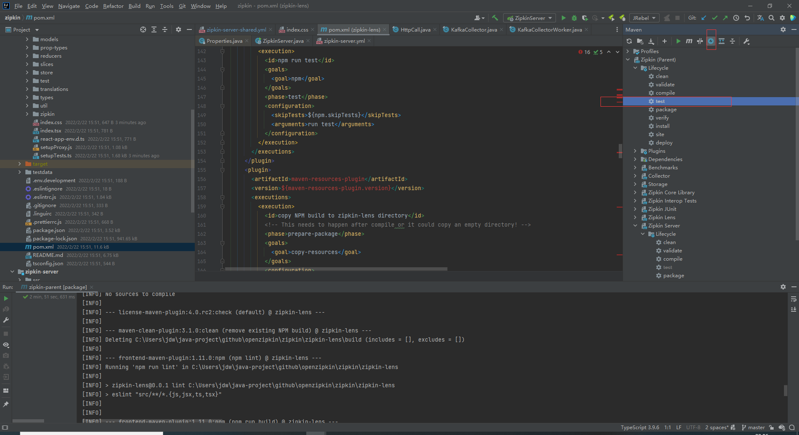
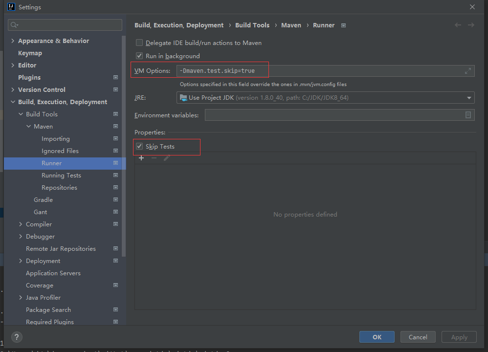
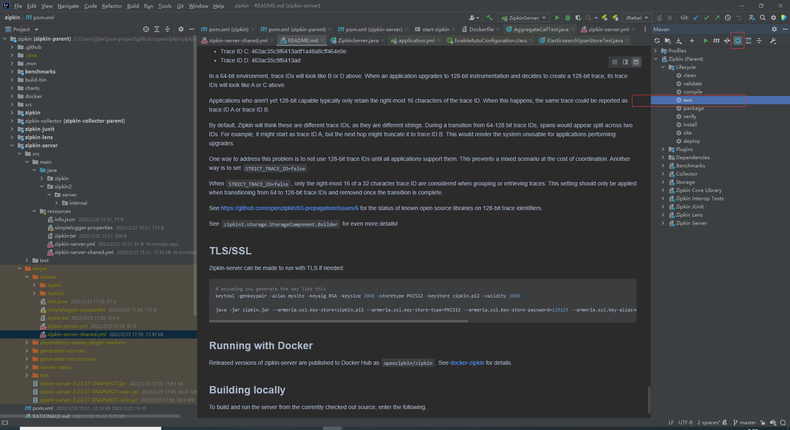
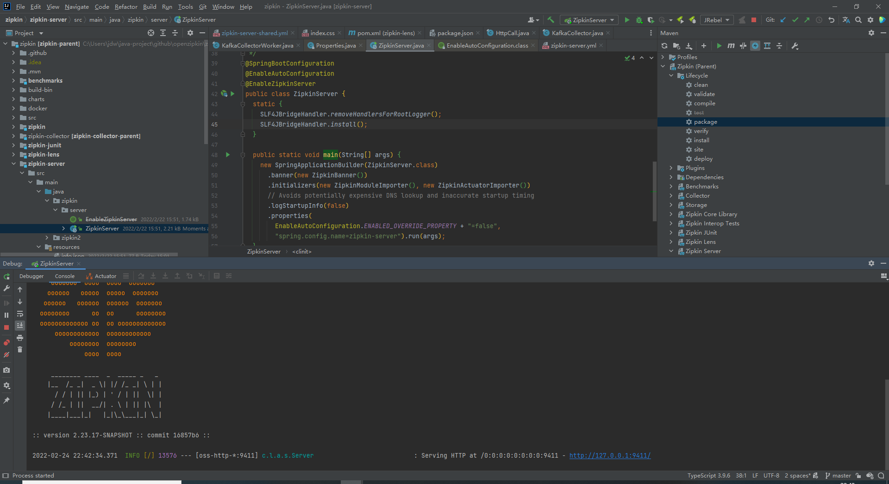
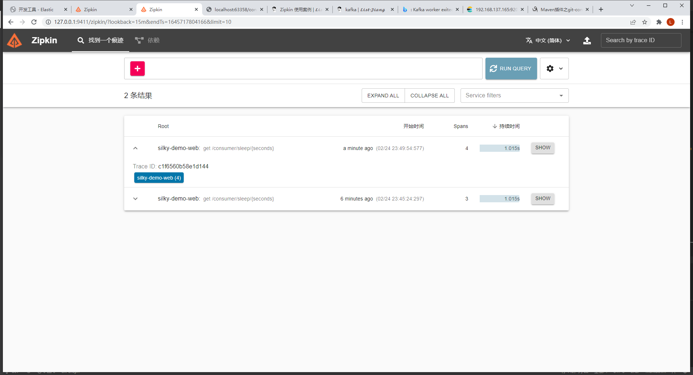
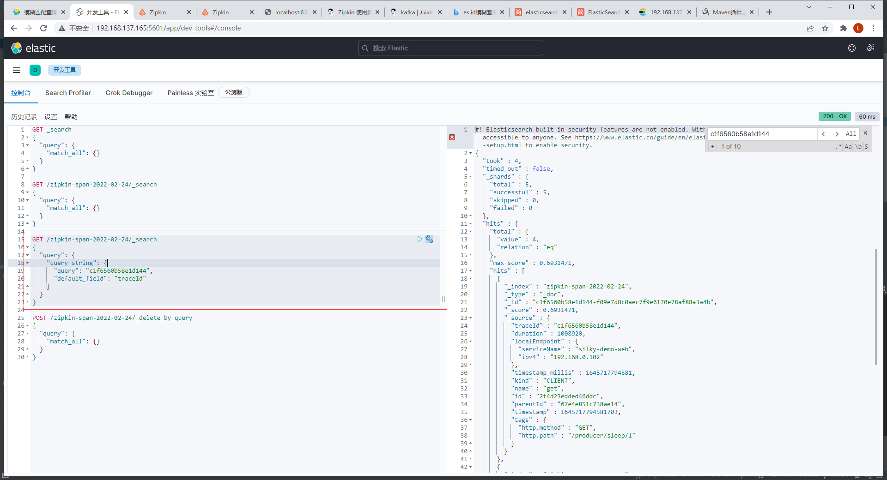

## 场景
处理慢接口，定位Spring Cloud 服务间调用，确定各个链路执行时间

### 涉及所有软件

- [微服务项目地址](https://gitee.com/jdw-silky/silky-parent.git)
- [zipkin 源码地址](https://github.com/openzipkin/zipkin.git)
- [kafka](https://kafka.apache.org/downloads)
- [Elastic search](https://www.elastic.co/cn/elasticsearch/)
- [kibana](https://www.elastic.co/cn/kibana/)

### 环境准备

- [jdk17](https://jdk.java.net/17/)
- [maven](https://maven.apache.org/)
- [Intellij IDEA](https://www.jetbrains.com/idea/)

## 实现效果

微服务之间调用链路耗时，能在 zipkin 看到，并且能看区分长请求。链路数据入 Elastic Search 库。

### 安装 ES、kafka

docker 对于技术学习测试真的很方便

- [ES 集群安装](https://www.cnblogs.com/jiangdewen/p/15119574.html)
- [kibana 安装](https://www.cnblogs.com/jiangdewen/p/15118629.html)

- [kafka 安装](../../../middleware/mq/kafka/quick-start.md)

### 启动微服务项目

提一句，微服务集成 zipkin 除了增加了两个引用与少量的环境配置，不改变任何代码。

```
    implementation 'org.springframework.cloud:spring-cloud-sleuth-zipkin'
    implementation 'org.springframework.cloud:spring-cloud-starter-sleuth'
```

```yml
spring:
  application:
    name: silky-demo-web
  zipkin:
    service:
      name: ${spring.application.name}
    sender:
      type: kafka
    kafka:
      topic: zipkin
  kafka:
    bootstrap-servers: 192.168.137.165:9091,192.168.137.165:9092,192.168.137.165:9093

```

### 启动 zipkin

[服务器启动方式](quick-start.md)

#### 以源码启动

Intellij IDEA 以源码启动 zipkin 服务，主要难的是这个。此处需要配置 [maven 跳过测试](https://www.cnblogs.com/jiangdewen/p/15928589.html)。

maven 跳过测试配置： `-Dmaven.test.skip=true`






> 由于 zipkin-lens 项目用到了 [react](https://react.docschina.org/) 。如果该 zipkin-lens 打包出错，尝试配置 node 环境。

**配置文件修改**

修改项目启动配置文件 zipkin-server-shared.yml，之所以启动配置文件是这个，我们可以在启动类看到配置了 spring 启动参数 `spring.config.name=zipkin-server`。而 zipkin-server.yml 文件指定了 `spring.profiles.include: shared` 


```properties
# 项目实际为 yml 文件，此处用 properties 文件格式展示是为了便于笔记展示
# 配置 kafka bootstrap servers
zipkin.collector.kafka.bootstrap-servers=${KAFKA_BOOTSTRAP_SERVERS:192.168.137.165:9092}
# 配置 storage 类型
zipkin.storage.type=${STORAGE_TYPE:elasticsearch}
# 配置 es 集群 url
zipkin.storage.elasticsearch.hosts=${ES_HOSTS:http://192.168.137.165:9201,http://192.168.137.165:9202,http://192.168.137.165:9203}

``

**启动 zipkin 项目**

项目启动必须先进行 maven 打包才行。



运行 `zipkin.server.ZipkinServer#main` 启动项目



**启动微服务项目**

便于测试可以写几个简单的脚本

- eureka-server.bat
```bash
d:
cd D:\ideaProject\gitee\jdw-silky\silky-parent\silky-eureka-server\build\libs
java -jar silky-eureka-server-1.0.1.jar --spring.profiles.active=native
```
- config-server.bat
```bash
d:
cd D:\ideaProject\gitee\jdw-silky\silky-parent\silky-config\build\libs
java -jar silky-config-1.0.1.jar --spring.profiles.active=native
```
- web-server.bat
```bash
d:
cd D:\ideaProject\gitee\jdw-silky\silky-parent\silky-demo-web\build\libs
java -jar silky-demo-web-1.0.1.jar --spring.profiles.active=native
```
由于 web-server 服务的启动端口配置为 0 ，所以直接多点击两下就启动了几个 web-server 服务。

#### 验证

1. 调用一次 web 服务


2. 在 zipkin 界面查看调用链



3. 使用 kibana 查找调用链记录



可以看到，一个调用链在 zipkin 看到了，并且持久化到 Elastic Search 里面了
